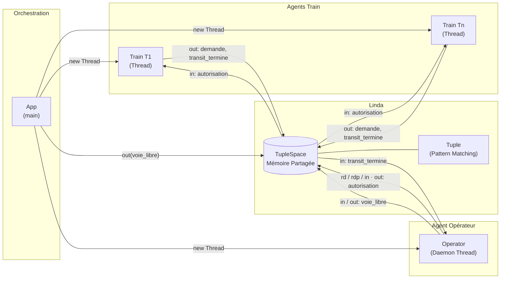
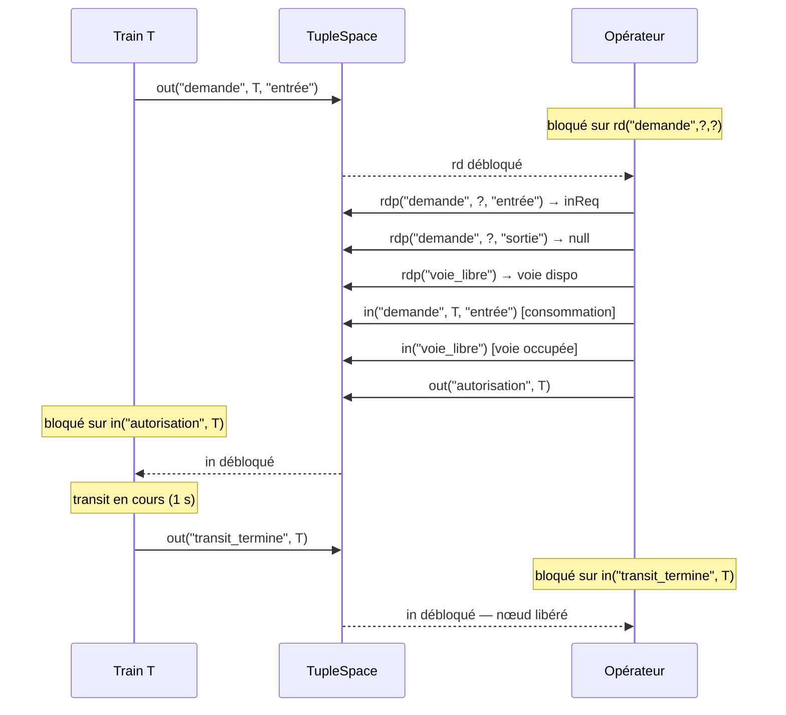

PALANCA Clement
DUQUENOY Taina
CAGNON Leny

# Compte Rendu de TP : Implémentation du Modèle Linda et Simulation de Nœud Ferroviaire

## 1. Architecture Logicielle

### Schéma Composants/Connecteurs



> **Lecture** : Le `TupleSpace` est le **connecteur central** du système. Aucun agent ne détient de référence vers un autre — toute coordination passe exclusivement par le dépôt et la lecture de tuples.

## 2. Implémentation du Noyau Linda — Choix de Conception

Le cœur du système repose sur la classe `TupleSpace`. Contrairement aux systèmes à passage de messages classiques, le modèle Linda offre un découplage temporel et spatial total. Les choix d'implémentation suivants ont guidé la réalisation.

### Choix 1 : Sondes non-bloquantes (`rdp` / `inp`) pour l'Opérateur

L'Opérateur doit prendre une décision en observant simultanément l'état de plusieurs tuples (demandes en attente et disponibilité des voies). Utiliser des primitives bloquantes (`rd`, `in`) pour cette phase d'observation conduirait à un **interblocage** : l'Opérateur se bloquerait sur la première demande introuvable et ne pourrait plus traiter les autres.

### Choix 2 : Wildcard `null` comme variable formelle Linda

Dans le formalisme Linda, un motif contient des _variables formelles_ (ex. `?x`) qui s'unifient avec n'importe quelle valeur. Java ne disposant pas de mécanisme d'unification natif, le `null` Java est utilisé comme joker conditionnel dans `Tuple.matches()` : un champ `null` dans le motif accepte n'importe quelle valeur dans le tuple candidat. Cela préserve la sémantique du pattern matching Linda sans dépendance externe.

## 3. Modélisation des Agents et Automates d'États

Le système s'articule autour de threads autonomes.

### Spécification Formelle des Agents

Les agents sont décrits ci-dessous dans la notation Linda. Le symbole `?` désigne une variable formelle (wildcard), `←` une liaison de résultat, et `^ω` indique une boucle infinie.

**État initial de l'espace de tuples** :

```
TS₀ = { (voie_libre) × N }       -- N tuples représentant les voies disponibles
```

---

**Agent Train(id : string, direction : string)**

```
Agent Train(id, direction)
  out( demande,       id, direction ).      -- dépôt de la demande
  in(  autorisation,  id             ).     -- attente bloquante de l'autorisation
  out( transit_termine, id           )     -- libération du nœud
```

---

**Agent Opérateur(N : int)^ω**

```
Agent Opérateur(N)
  rd( demande, ?, ? ).                      -- attente bloquante d'une demande quelconque

  let inReq  ← rdp( demande, ?, entrée ).  -- demande d'entrée ?
  let outReq ← rdp( demande, ?, sortie ).  -- demande de sortie ?
  let track  ← rdp( voie_libre ).          -- voie disponible ?

  ([ inReq ≠ null ∧ outReq ≠ null ∧ track ≠ null ]
      in( demande,   inReq.id, entrée ).   -- conflit → priorité ENTRÉE
      in( voie_libre ).
      out( autorisation, inReq.id )
  +
  [ inReq ≠ null ∧ outReq ≠ null ∧ track = null ]
      in( demande,   outReq.id, sortie ).  -- conflit + parking plein → priorité SORTIE
      out( voie_libre ).
      out( autorisation, outReq.id )
  +
  [ inReq ≠ null ∧ outReq = null ∧ track ≠ null ]
      in( demande,   inReq.id, entrée ).     -- entrée seule, voie dispo
      in( voie_libre ).
      out( autorisation, inReq.id )
  +
  [ inReq ≠ null ∧ outReq = null ∧ track = null ]
      rd( demande, ?, sortie )             -- parking plein → attente sortie
      → Opérateur(N)                       -- réévaluation
  +
  [ inReq = null ∧ outReq ≠ null ]
      in( demande,   outReq.id, sortie ).    -- sortie seule
      out( voie_libre ).
      out( autorisation, outReq.id )
  )
  in( transit_termine, sel.id )           -- attente fin de transit (exclusion mutuelle)
  → Opérateur(N)                           -- retour début de boucle
```

> **Propriété de sûreté** : La séquence `out(autorisation)` → `in(transit_termine)` garantit qu'un seul train occupe le nœud à la fois. Aucun verrou explicite n'est partagé entre agents — l'exclusion mutuelle est entièrement portée par le protocole de tuples.

---

### L'Agent Train

Chaque train modélise une machine à états stricts :

1. **Émission de la demande** : Insertion asynchrone du tuple `("demande", id, direction)` via `out()`.
2. **Attente d'autorisation** : Appel d'une primitive `in(("autorisation", id))` bloquante. Le thread du train est mis en sommeil par l'ordonnanceur de l'OS jusqu'à ce que l'opérateur place le tuple exact.
3. **Libération de la ressource critique** : Après le transit, l'émission du tuple `("transit_termine", id)` fonctionne comme un signal de relâchement, restituant l'accès exclusif au nœud ferroviaire.

### L'Agent Opérateur

L'opérateur s'exécute dans un _Daemon Thread_ et gère l'accès en exclusion mutuelle au nœud ferroviaire. Son algorithme est une boucle infinie qui garantit l'application stricte du cahier des charges :

- **Optimisation** : L'opérateur utilise un `rd` bloquant initial sur n'importe quelle demande (`("demande", null, null)`). Si le réseau est vide, le thread s'endort proprement sans consommer de ressources.
- **Snapshot de l'état** : Réveillé, l'opérateur effectue des sondes `rdp` pour photographier l'état des demandes et la jauge de disponibilité des voies (`voie_libre`). Si l'entrée est demandée mais que le parking est plein, l'opérateur force explicitement un `rd` sur une demande de sortie, mettant en pause l'allocation pour éviter de bloquer indéfiniment l'entrée du nœud.
- **Gestion des conflits d'allocation** : Face à une demande simultanée, l'opérateur donne prioritairement le verrou logique à l'entrée afin de purger le trafic amont. Cette priorité est conditionnellement inversée au profit de la sortie si le parking est saturé. Cette heuristique garantit la vivacité globale du système.

### Schéma de Séquence

Le diagramme ci-dessous illustre le protocole complet pour un train en entrée (cas nominal) :



> **Propriété clé** : Le nœud ferroviaire est à usage **exclusif** — l'opérateur ne délivre une nouvelle autorisation qu'après réception du tuple `transit_termine`, garantissant l'exclusion mutuelle sans verrou explicite entre agents.
